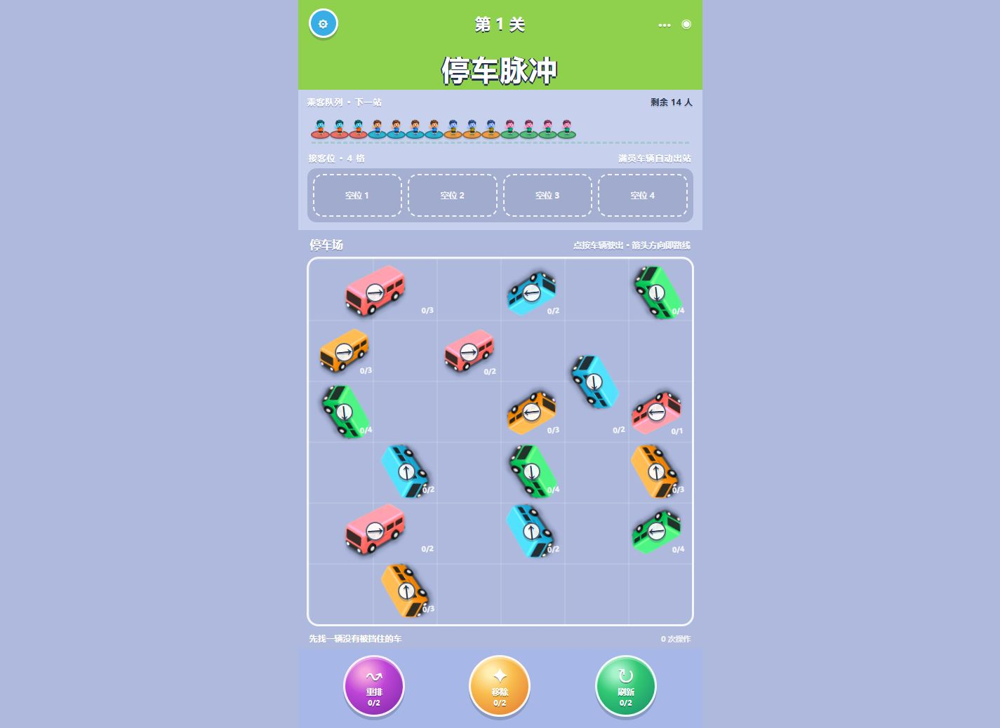
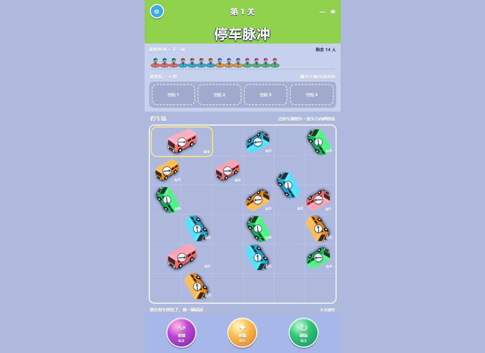
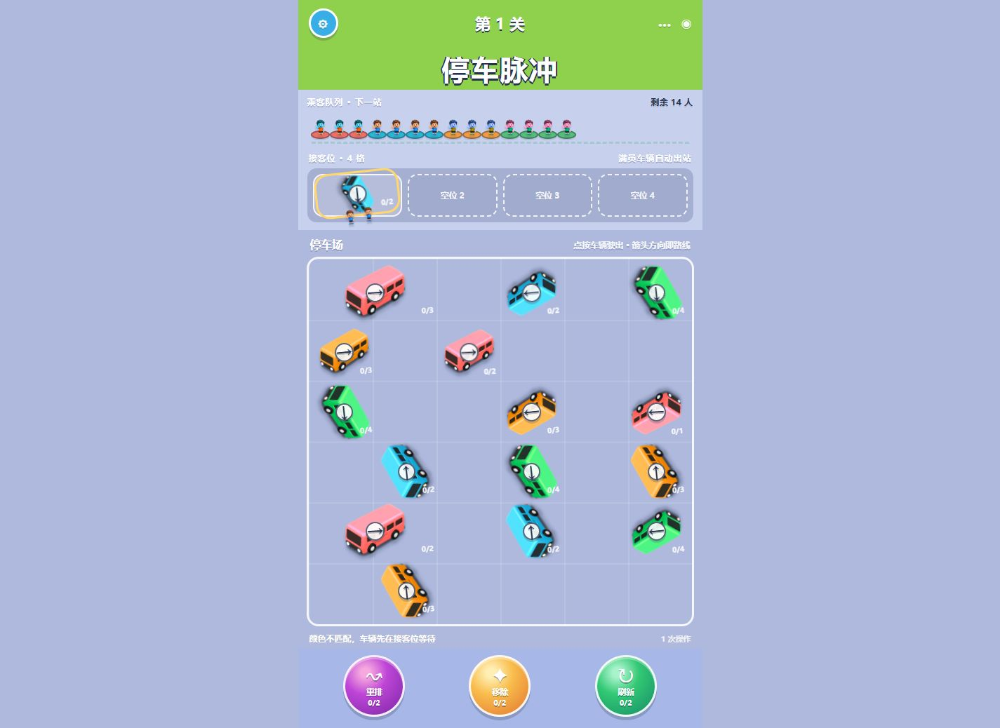
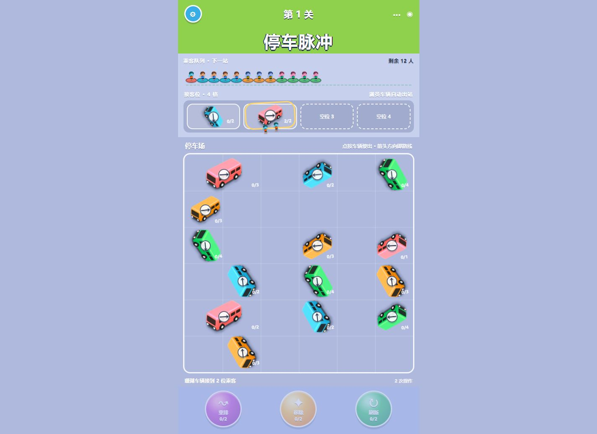
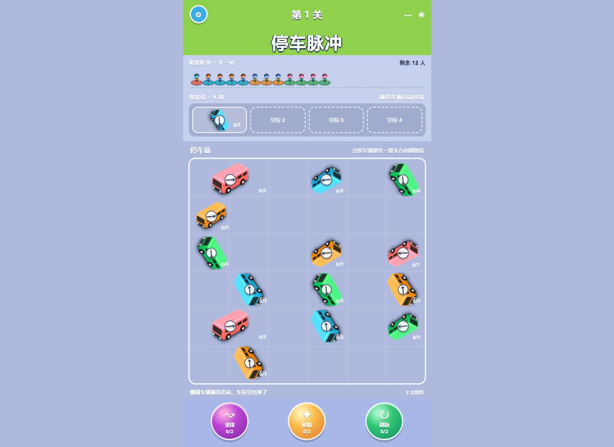
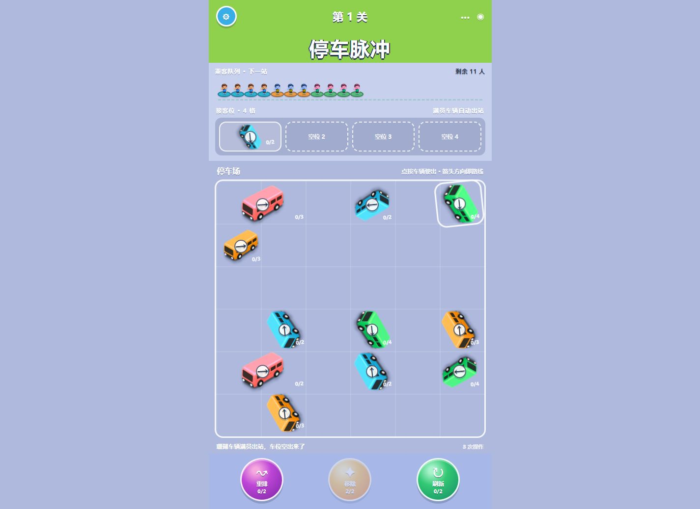
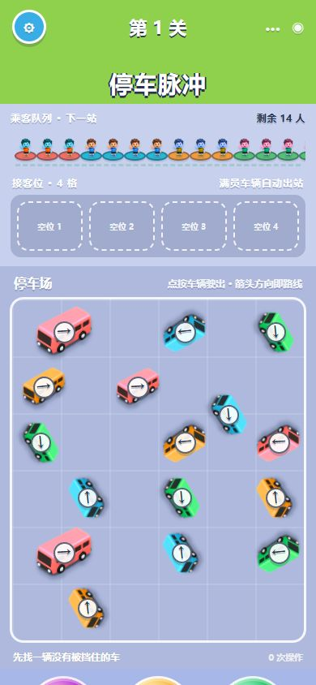
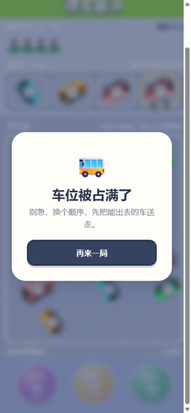

# 停车脉冲产品体验审计

日期：2026-08-29

范围：`Games/parking-pulse.html` 的桌面端与 390 × 844 手机端主流程；覆盖初始态、被阻挡车辆、错色候车、正确装客、自动出站、道具、失败弹窗、响应式与基础可访问性。

## 总体判断

视觉完成度已经达到可试玩水平，但核心规则存在发布阻断问题。最严重的是：车辆进入接客位后只在入场瞬间检查一次乘客，后续即使队首颜色已经匹配也不会再次装客；这会让正确颜色的车辆永久占位，并制造不符合玩家预期的失败。

建议先完成规则修复与可解性回归测试，再继续做多关卡、留存和视效扩展。

## 流程证据

### 1. 初始页面——一般

- 优点：三段式信息结构清楚，车辆、乘客、车位的关系一眼可见；车辆与道具的视觉语言一致。
- 问题：1440 × 900 下页面高度为 1038px，需要滚动才能看到完整道具；初始道具计数显示 `0/2`，更像“没有道具”，实际表达的是已使用次数。

### 2. 点击被阻挡车辆——良好

- 黄色描边、抖动和状态文案能解释点击失败。
- 但每次 `render()` 都重建整个棋盘和队列，交互后焦点会掉回 `body`，键盘用户需要重新定位；所有乘客入场动画也会重复播放。

### 3. 错色车辆进入接客位——差

- 文案正确说明“颜色不匹配”。
- 画面却同时播放两名乘客上车动画，载客数仍为 `0/2`，反馈互相矛盾。

### 4. 正确车辆装客并自动出站——一般

- 正确装客、满员、自动离场和车位释放均可观察到。
- 状态信息只放在棋盘底部，桌面和手机首屏都可能被遮在下方；缺少声音/震动开关和减少动态效果支持。

### 5. 队首改变后，候车车辆不再装客——严重

- 队首已经变为晴蓝，接客位中的晴蓝车辆仍停在 `0/2`。
- 根因：`loadPassengers(vehicle)` 只在车辆进入车位时调用；队列变化、其他车辆出站、重排之后，没有统一的候车区结算循环。

### 6. 390 × 844 手机首屏——一般偏差

- 无横向滚动，车辆最小点击区域约 60 × 67px，道具约 86 × 86px，触控尺寸合格。
- 页面总高约 935px，三个核心道具在 844px 首屏下只露出顶部，需要滚动后才能发现。
- 白色小字位于浅紫背景上，对比度约 1.54:1–1.99:1，明显低于普通文本常用的 4.5:1 目标。

### 7. 失败弹窗——视觉良好、可访问性差

- 弹窗层级、文案和主按钮明确。
- 弹窗打开后焦点停在 `body`，背景控件仍保留在可访问树中；没有焦点锁定、焦点恢复或 Escape 处理。

## 优先级问题与改进方案

### P0：先修核心规则

1. 候车车辆不会在队首变化后重新装客。
   - 新增统一的 `resolveBoarding()`：任何队列、车位或车辆状态变化后，从左到右反复检查所有候车车辆，装客、满员出站并继续结算，直到状态稳定。
   - 只有实际装载人数大于 0 时才显示乘客上车动画。
2. 失败判定过早或不完整。
   - 当前车位满时点击车辆会直接 `forceLose`；但玩家可能仍有重排等恢复手段。
   - 失败条件应综合判断：候车区无可自动装客车辆、棋盘无可移动路径、没有能改变局面的道具，并且无法腾出车位。
3. 关卡缺少自动可解性保护。
   - 为关卡配置增加固定解法回归测试，覆盖正常胜利、错色候车后再匹配、连锁出站、满位但可恢复、真正失败和道具耗尽。

### P1：提高可理解性和可恢复性

1. 恢复“重来”入口。`#reset-button` 被 CSS 永久隐藏，玩家只能等失败或刷新页面。建议放到右上角，并在有进度时二次确认。
2. 道具显示剩余次数：初始应为 `×2` 或 `剩余 2`，而不是 `0/2`。
3. “刷新”应改名为“调头”，或按设计稿真正刷新颜色与方向；必须先明确选车，并校验旋转后不越界、不与其他车辆重叠。
4. “移除”进入选择模式后应显示明显的模式条和取消按钮，不要在玩家尚未选车时就静默扣次数。
5. 手机端把道具栏做成底部固定/粘性区域，棋盘使用剩余高度；目标是 390 × 844 下主循环无需滚动。
6. 把浅紫底上的小号白字改为深蓝字，或显著加深背景；保留颜色之外，再用色名缩写、纹理或形状标记乘客/车辆。

### P1：可访问性

1. 相同颜色、方向、容量的车辆有重复无障碍名称；加入位置和状态，例如“第 3 行第 6 列，珊瑚车，向左，容量 1，可移动”。
2. 接客位车辆渲染为 `<button>` 但不可操作；若不支持交互，应改成非按钮元素并移出 Tab 顺序。
3. 避免每次操作重建所有按钮；保留操作后焦点，失败/胜利弹窗打开时聚焦主按钮、锁定背景并在关闭后恢复焦点。
4. 队列不应整体使用 `aria-live` 并反复重建 14 个乘客；只播报“剩余人数、当前队首、装客结果”。
5. 增加 `prefers-reduced-motion`，关闭队列重复入场、抖动和长位移动画。

### P2：功能与留存

1. 增加一个 30 秒教学关：只保留 3 辆车和 2 个车位，分步讲清箭头、颜色队首和满员出站。
2. 连续两次点击被挡车辆后提供一次免费提示，高亮可行车辆；支持一步撤销，降低误操作挫败。
3. 做关卡进阶：车位数、车辆长度、容量和颜色数逐步增加；胜利弹窗显示星级、最佳步数和“下一关”。
4. 增加音效、震动与静音开关；不要把“返回”画成齿轮，也不要让齿轮和省略号执行同一个返回动作。
5. 关键指标：首局完成率、首次有效点击耗时、无效点击率、重开率、道具使用率、失败原因和第 3 关留存。

## 建议验收标准

- 队首颜色变化后，已有同色候车车辆在 300ms 内自动装客并正确连锁出站。
- 错色车辆不播放上车动画。
- 关卡有至少一条不依赖道具的验证解，且所有失败局都不存在合法恢复动作。
- 390 × 844 下乘客、车位、棋盘状态和三个主要道具均完整可见，无横向滚动。
- 普通文本对比度达到 4.5:1；所有交互目标至少 44 × 44px。
- 弹窗打开时焦点进入弹窗、背景不可操作，关闭后焦点回到触发点。

## 证据限制

- 已检查浏览器运行、源码与控制台；控制台无报错或警告。
- 未在真实触摸设备、屏幕阅读器或系统“减少动态效果”模式下验证。
- 因核心候车结算缺陷，本轮未把“正常通关”作为通过项；失败路径已完整走通。
