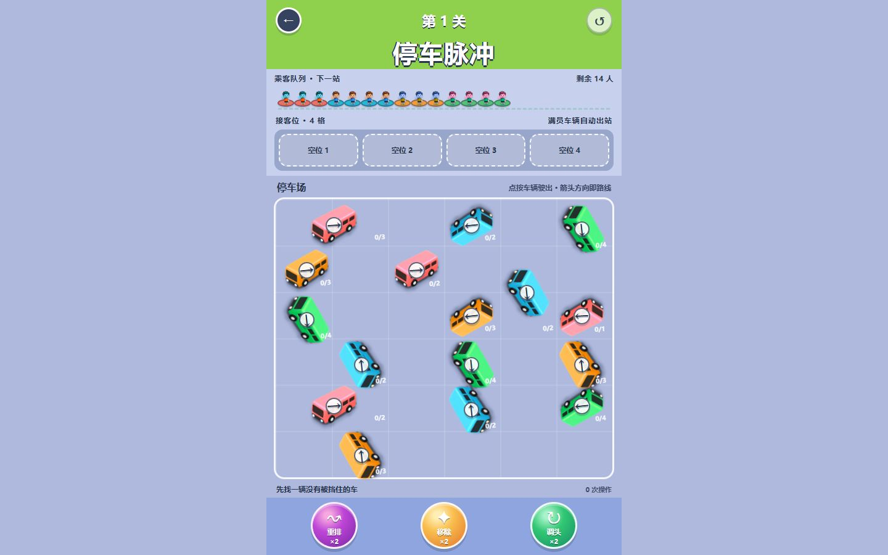
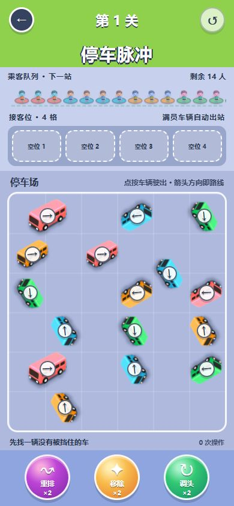
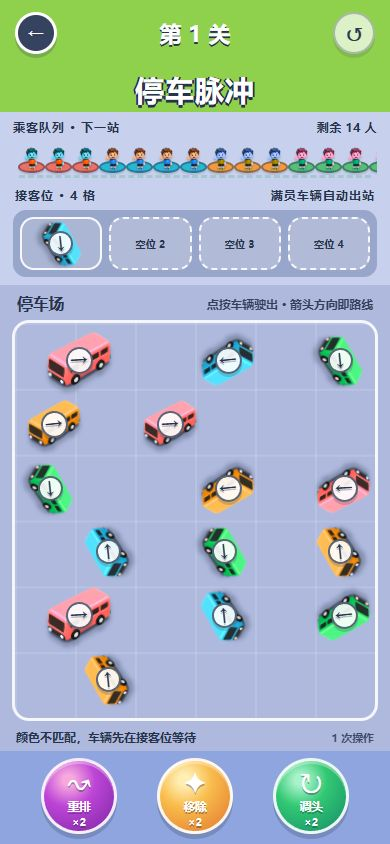
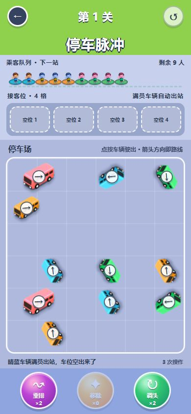
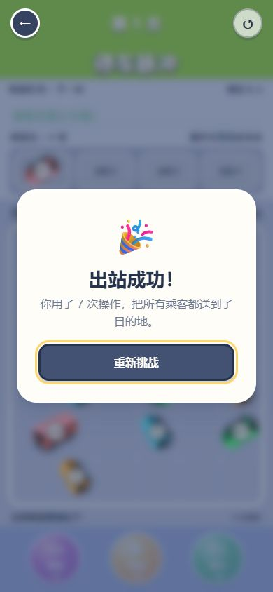
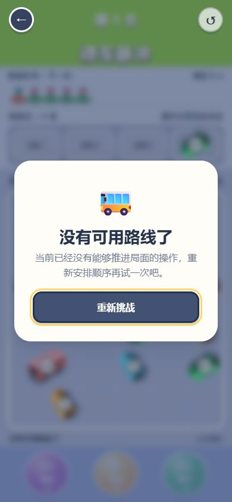

# 停车脉冲修改后验证

日期：2026-08-30

## 结果

本轮修复通过。核心候车结算、胜负判定、中途重开、道具选择、手机首屏和弹窗焦点均按预期工作。

## 验证项

- 内联脚本语法：通过。
- HTML `id` 唯一性：通过，共 20 个 `id`。
- 桌面 1440 × 900：页面高度等于视口，无横向或纵向滚动，所有道具完整可见。
- 手机 390 × 844：页面高度等于视口，无横向或纵向滚动；三个道具均为 76 × 76px，底部坐标 834px；重开按钮为 42 × 42px。
- 错色车辆：进入候车位后保持 `0/2`，没有播放乘客上车动画。
- 连锁装客：队首从珊瑚切换为晴蓝后，已在候车位等待的晴蓝车辆自动装载 2 人并离场。
- 正常胜利：完成一条 7 次车辆操作的通关路径，剩余人数为 0。
- 真正失败：耗尽有效道具且棋盘无可行路线后显示“没有可用路线了”。
- 弹窗焦点：胜利和失败弹窗打开时，“重新挑战”自动获得焦点，主游戏区域设置为 `inert` 和 `aria-hidden="true"`。
- 中途重开：车辆移动动画尚未完成时重开，延迟任务被清除，状态正确恢复为 16 辆车、0 次操作、0 个已占用车位。
- 道具选择：进入“移除”模式不会提前扣次数，再点一次可取消。
- 浏览器控制台：0 个错误，0 个警告。

## 截图

### 桌面首屏

### 手机首屏

### 错色车辆正确候车

### 候车车辆自动补装客后离场

### 胜利弹窗

### 失败弹窗

