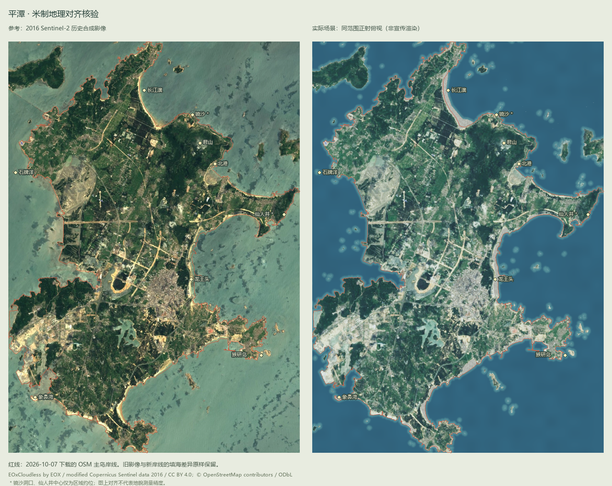

# 实际验收记录

测试日期：2026-10-07 Asia/Shanghai。实际静态构建 URL：http://127.0.0.1:5187/。原始记录：[test-results.json](../../evidence/test-results.json)。以下截图均来自真实运行的浏览器，没有使用概念渲染或生成图片。

5km 比例尺按实际米制方位图缩放。桌面与触屏模拟截图来自本轮测试。锁文件此前在隔离目录通过 npm ci 安装验证。

## 交付边界与阶段

第一阶段已完成：真实主岛闭合岸线、米制坐标、公开高程与全岛鸟瞰。

第二阶段交付北港有限样板：两处真实建筑轮廓上的类型化石厝、近岸岩石、材质、灌木和海水；缺少完整逐栋测绘与高分辨率地表，不是完整村落实景。第三阶段完成其他沿海景点定位、真实风机点位与道路分布、交互、LOD、移动端配置及错误处理；其他区域的精细实景仍需补充资料。

## 截图

- [全岛鸟瞰](../../evidence/overview.png)
- [北港区域](../../evidence/beigang.png) / [石厝近景](../../evidence/stone-close.png)
- [长江澳](../../evidence/changjiang.png) / [龙王头](../../evidence/longwang.png)
- [镜沙区域](../../evidence/jingsha.png) / [洞内近景](../../evidence/jingsha-close.png)
- [仙人井](../../evidence/xianren.png) / [井底近景](../../evidence/xianren-close.png)
- [石牌洋](../../evidence/shipaiyang.png) / [猴研岛](../../evidence/houyan.png) / [象鼻湾](../../evidence/xiangbi.png)
- [自由飞行](../../evidence/flight.png) / [早晨太阳方向](../../evidence/morning.png)
- [触屏模拟](../../evidence/mobile.png) / [数据披露](../../evidence/data-disclosure.png) / [加载失败](../../evidence/resource-failure.png)
- [同范围参考影像与真实场景对齐](../../evidence/map-alignment.png)

## 与参考资料的对照

对照图左侧是 2016 年 EOxCloudless 原始重投影影像，右侧是实际 Three.js 场景的正射俯视。两图使用相同 UTM 包络，红线是 2026-10-07 下载的 OSM 主岛岸线。对齐内容包括北部半岛和长江澳凹湾、东北君山山体与北港海湾、东岸龙王头弧形沙滩、南部海湾与内陆湖/路网位置。这里只核对图上空间关系，没有独立测量 RMSE 或实地控制点精度。

西南填海和港区边缘可以看到新岸线与旧影像不重合。没有通过拉伸坐标或绘制假影像消除这项差异。渲染色调、海面和环境光与原始影像不同，不属于地理定位误差。

本次海岸补充：52处真实沙滩多边形，修复长江澳潮间带误筛；81海上/99陆上点位、海上机组入口；龙王头双层红色观光车、800m三站示意轨迹；坛南湾与北部岩岸。新截图：[海上风机](../../evidence/offshore.png)、[小火车近景](../../evidence/train-close.png)、[坛南湾](../../evidence/tannan.png)、[北部岩岸](../../evidence/north-rock.png)。车辆参考新闻照片，未取得真实轨迹控制点。

本轮统一扩展为15处定位、19项景观覆盖清单，按北/东/南/西岸和内陆分组，可搜索名称。新增镜沙、仙人井、石牌洋、猴研岛、象鼻湾、将军山、南寨山、澳前及DEM君山峰位。镜沙洞口和仙人井中心只是区域约位，近景表面为参考建模；仙人井官方报道约50m口径、43m井深用于模型尺度，不能将源DEM约11m的粗表面当作真实井口测量。参见 [各景观依据、分类与资料缺口](LANDSCAPES.md)。海陆掩膜边缘的白缝、镜沙近景相机穿过洞顶和仙人井井缘浮点尖刺在截图核对后修复。

对照新增特征：镜沙所在沙湾东端黑岩区、东岸仙人井所在景区、石牌洋独立小礁盘、猴研岛狭窄水道及象鼻湾西向沙堤。地图对照只核对区域和源轮廓；洞形、井壁、石帆曲面和单块岩石未达到测绘对齐。大福湾、沙地底与海坛古城精模仍缺资料；海坛天神和通天门在主岛范围外，已列入清单。

北港外观依据 [福建省文旅厅/住建厅官方村落照片](https://wlt.fujian.gov.cn/zwgk/ztzl/fjsjplyc/ptzhsyqbgc/201908/t20190805_5294531.htm) 核对青灰花岗岩、低坡瓦顶、压瓦石及小窗门。对照仅是共性形式；没有把参考照片中店铺认作 OSM 两处民宿。另有本地 photo-comparison-local.png 供研究核对，含版权照片，未放入公开静态资源或分发包。

## 测试设备与性能

- 实际设备：13th Gen Intel(R) Core(TM) i5-13600KF，31.8 GiB 内存；Windows_NT 10.0.26200。
- 实际 WebGL：ANGLE (NVIDIA, NVIDIA GeForce RTX 4070 (0x00002786) Direct3D11 vs_5_0 ps_5_0, D3D11)。
- 浏览器：Chromium 151.0.7922.34，headless，硬件 WebGL；桌面视口 1440×960，DPR 1。
- 手机只做 Chromium 390×844、DPR 2、touch 模拟，渲染 DPR 自动限制为 1；仍使用同一 RTX 4070，**没有真实手机 GPU/FPS 实测**。
- 每项采样 3.5 秒；帧率是 requestAnimationFrame 的实际间隔，约 60Hz 受显示节奏限制，不能据此声称 GPU 上限或真实移动端 60FPS。

| 视图 | 画质 | 观测 rAF FPS | p95 帧间隔 | Draw calls | 三角形 |
|---|---|---:|---:|---:|---:|
| 全岛鸟瞰 | medium | 60 | 16.8 ms | 303 | 416,347 |
| 龙王头观光车近景 | medium | 60 | 16.8 ms | 168 | 933,589 |
| 镜沙洞口近景 | medium | 60 | 16.8 ms | 33 | 1,080,363 |
| 仙人井近景 | medium | 60 | 16.7 ms | 25 | 281,210 |
| 北港石厝近景 | high | 60 | 16.7 ms | 212 | 534,573 |
| 北港区域 / low | low | 60 | 16.8 ms | 329 | 945,759 |
| 北港区域 / medium | medium | 60 | 16.8 ms | 344 | 1,303,893 |
| 北港区域 / high | high | 60 | 16.7 ms | 358 | 1,339,189 |

本地测试页面从导航到场景 ready 为 1502ms，仅代表此次 localhost 环境，不是外网冷启动时间。正常运行脚本错误 0、请求失败 0、断言失败 0。

## 验证内容

- Real-data initial scene and overview
- Data categories, source links, help and keyboard dialog close
- Mouse orbit / wheel
- 52 mapped beaches; 81 offshore / 99 onshore; photo-reference double-deck train and illustrative 800m route
- All 15 destinations, source/approximate classifications and smooth transitions
- Landscape search, 19-entry disclosure, metre-scale 43m well, close-view cameras, finite landmark meshes
- Photo-reference sample, detailed roof, PBR surfaces, high quality
- Local-date time and solar direction
- Free flight, WASD, Q/E, H reset and minimum 2.5m terrain clearance
- Minimap landmark positioning
- PNG export
- 390×844 touch emulation, low profile, pinch, tap destination, touch flight
- Required data failure names missing resource; optional imagery failure retains real geometry

最低离地保护实测 2.5m。全部15处预设相机均在对应视觉表面之上。触屏捏合与前进按钮实测有效。故意让 terrain.json 返回 404 后显示具体错误；故意让卫星图失败后仍显示真实地形并提示缺失。

## 当前未达到的目标

尚未达到整岛真实航拍/摄影测量质量。主要原因：2016 年约 10–14m 图像无法提供近距离地表细节；原 DEM 约 30m 不能表现微地形；多数村屋缺失轮廓、高度和立面；近岸水深和潮位缺失；植被、岩石、风机形制为近似。北港样板仍是类型化模型，不是对应建筑的精确复原。近期正射、1–5m 裸地高程、逐栋调查与海洋资料的接入见 EXTENDING.md。
