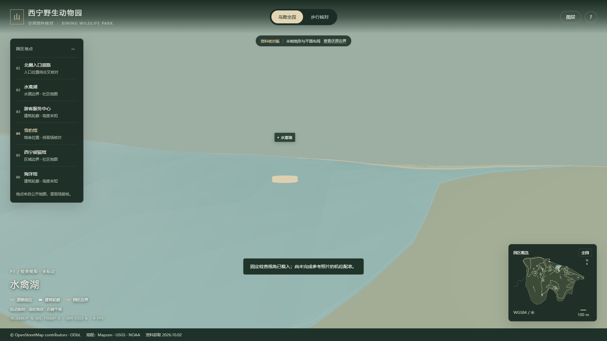
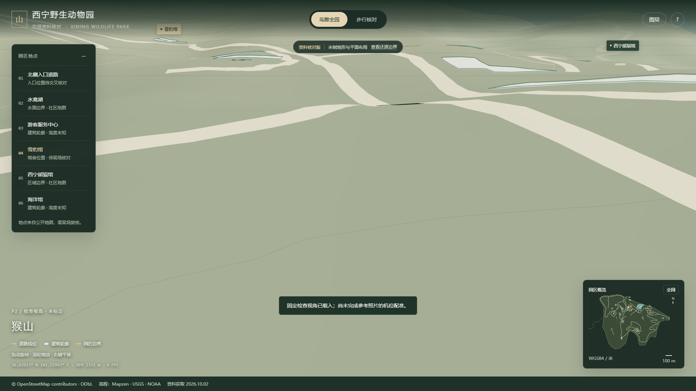
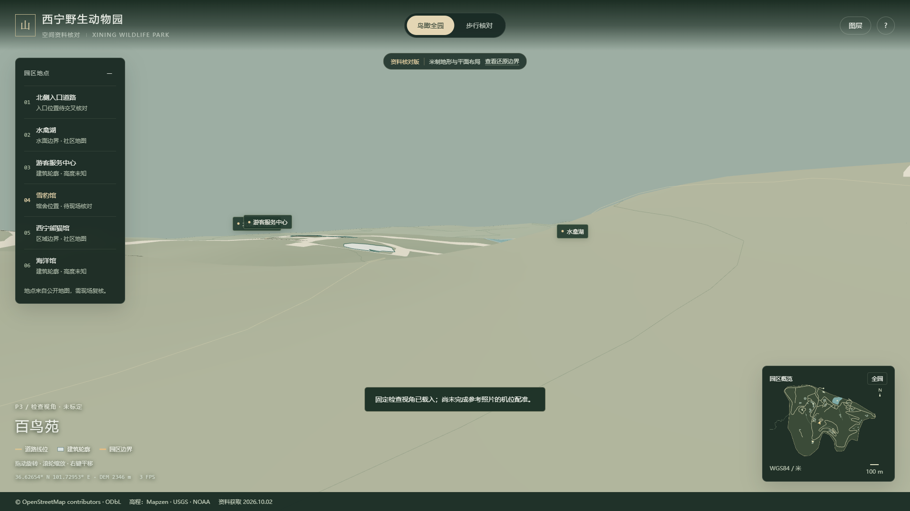

# 三组参考照片与固定检查视角

**结论：三组均未通过写实复原验收。** 已建立可重复查看的位置并输出场景截图，但没有照片的原始机位、焦距和测量基准，不能声称已经匹配参考照片。

在网页点击“查看还原边界”，滚动到最下方，选择 P1 / P2 / P3，可载入对应检查视角。相机参数保存在 `assets/data/layout.json` 的 `checkpoints`，状态为 `unregistered-candidate`。三组视野均使用工程参数 50°，并非根据 EXIF 确定。鸟瞰控制器还会约束相机避免进入地形；预设参数不能当作现场测量值。

新闻照片未获得可再分发授权，因此本报告提供原文链接及文字观察，不内嵌、热链或打包原照片。下面只展示本项目生成的截图。

## P1 · 水禽湖

- 参考：[光明网账号转载西海都市报记者赵俊杰摄影报道](https://news.qq.com/rain/a/20210427A02L2000)。发布时间 2021-04-27 10:01，报道指向 4 月 26 日改造投入使用；具体照片拍摄时间未单独标注。
- 原图特征：湖面、带石砌驳岸的小岛、灰白置石、岸边落叶乔木、红色栏杆/桥段，背景有城市高楼。
- 地图依据：[OSM 水禽湖 way 237978036](https://www.openstreetmap.org/way/237978036)。
- 机位策略：因照片远处有城市高楼，暂在湖南側朝北观察。局部坐标相机 X=112、Z=−225，目标 X=105、Z=−293。位置和朝向尚未通过地标配准确认。

|检查项|结果|
|---|---|
|建筑轮廓与比例|背景城市建筑未建模，不能比较|
|道路和建筑的相对位置|只有社区道路及水面边界；拍摄点、岛屿和桥段无法定位，未通过|
|地形高差|已有区域 DEM；没有湖水位与驳岸高差测量，未通过|
|材质颜色与植被分布|当前仅分析填色，未还原照片中的石材、树木、栏杆与水体，未通过|

## P2 · 猴山

- 参考：[同一篇 2021-04-27 摄影报道](https://news.qq.com/rain/a/20210427A02L2000)。具体照片拍摄时间未单独标注。
- 原图特征：由上向下观察的近圆/椭圆形围合场地；中央不规则假山；外围墙面蓝色彩绘；观众栏杆、树木和游乐设施。
- 地图依据：[OSM 猴山 node 13963131416](https://www.openstreetmap.org/node/13963131416)。只有地点信息，不能用一个点生成整个围合场。
- 机位策略：以该地点为目标暂设俯视检查位置；相机经纬度约 101.72962°、36.62846°，地形上方 12 米为观察参数。没有确定该坐标就是照片机位。

|检查项|结果|
|---|---|
|建筑轮廓与比例|围墙、假山和内场没有可定位平面/尺寸，未建模，未通过|
|道路和建筑的相对位置|仅保留周围已录入道路；游客观察平台位置未知，未通过|
|地形高差|DEM 无法表达下凹场地和围合墙高差，未通过|
|材质颜色与植被分布|彩绘墙、石材与树木均未还原，未通过|

## P3 · 百鸟苑

- 参考：[西海都市报《新改造后的西宁野生动物园百鸟苑》相关报道](https://news.qq.com/rain/a/20210427A01V1Y00)。发布时间 2021-04-27 09:08，记者赵俊杰；具体拍摄时间未单独标注。
- 原图特征：棕红色岩壁与挡墙、块石/砖砌坡道、蜂窝状铺面和局部鸟类。画面只覆盖展区内部局部。
- 地图依据：[OSM 西野百鸟苑 way 1000455159](https://www.openstreetmap.org/way/1000455159)。另有同名节点，其位置和多边形对应关系未现场核对。
- 机位策略：在地图范围附近选择局部检查位置 X=−104、Z=−26，朝目标 X=−87、Z=−60；由于原图无足够定位地标，**无法判断真实朝向**，该视角不能用于像素级对齐。

|检查项|结果|
|---|---|
|建筑轮廓与比例|岩壁、挡墙、坡道没有尺寸和完整照片覆盖，未建模，未通过|
|道路和建筑的相对位置|展区内路线无法从照片确定，未补造，未通过|
|地形高差|区域 DEM 无法解析局部台阶和岩壁，未通过|
|材质颜色与植被分布|未建立现场材质及植被；未用照片中的个体位置推断当前动物位置，未通过|

## 如何转入正式三机位验收

每个机位至少需要：原始照片与拍摄时间、相机站点坐标或能在平面图上定位的地标、朝向、焦距/视野、一个已知长度，以及对应区域完整平面和关键高差。资料就绪后锁定相机与统一场景日期，再对轮廓、道路关系、地形和材质分别标注偏差。当前不提供没有依据的像素误差、米级误差或完成百分比。
